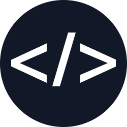

#  Kyan Bosman's Portfolio

Welcome to the personal portfolio of Kyan Bosman, also known as Kyan0045. I am a backend developer from the Netherlands. This website showcases my projects, skills, and provides a way to contact me for development services.

<table>
  <tr>
    <td>
      Welcome to the personal portfolio of Kyan Bosman, also known as Kyan0045. I am a backend developer from the Netherlands. This website showcases my projects, skills, and provides a way to contact me for development services.
    </td>
    <td>
      
    </td>
  </tr>
</table>

## Table of Contents

- [Getting Started](#getting-started)
- [Available Scripts](#available-scripts)
- [Project Structure](#project-structure)
- [Features](#features)
- [Technologies Used](#technologies-used)
- [SEO and Social Media](#seo-and-social-media)
- [Learn More](#learn-more)
- [License](#license)

## Getting Started

This project was bootstrapped with [Create React App](https://github.com/facebook/create-react-app).

### Prerequisites

Make sure you have the following installed on your machine:

- [Node.js](https://nodejs.org/) (v14 or later)
- [npm](https://www.npmjs.com/) (v6 or later)

### Installation

1. Clone the repository:

   ```sh
   git clone https://github.com/kyan0045/portfolio.git
   cd portfolio
   ```

2. Install the dependencies

```sh
npm install
```

### Running the App

To start the development server, run:
```sh
npm start
```
Open [http://localhost:3000](http://localhost:3000) to view it in your browser. The page will reload when you make changes. You may also see any lint errors in the console.

## Available Scripts

In the project directory, you can run:

- **`npm start`**: Runs the app in development mode.
- **`npm test`**: Launches the test runner in interactive watch mode.
- **`npm run build`**: Builds the app for production to the `build` folder.
- **`npm run eject`**: Ejects the Create React App configuration (use with caution).

## Project Structure

```plaintext
├── public
│   ├── index.html
│   ├── favicon.ico
│   └── ...
├── src
│   ├── Blog.js
│   ├── App.js
│   ├── index.js
│   └── ...
├── .gitignore
├── package.json
└── README.md
```

## Features

- **Responsive Design**: Optimized for various screen sizes.
- **SEO Optimized**: Meta tags for better search engine visibility.
- **Social Media Integration**: Open Graph and Twitter Card meta tags.
- **Easy Navigation**: Intuitive navigation bar to access different sections.

## Technologies Used

- **React**: JavaScript library for building user interfaces.
- **React Router**: Declarative routing for React applications.
- **Tailwind CSS**: Utility-first CSS framework for styling.
- **Create React App**: Tool to set up a modern web app by running one command.

## License

This project is licensed under the MIT License. See the [`LICENSE`](LICENSE) file for details.